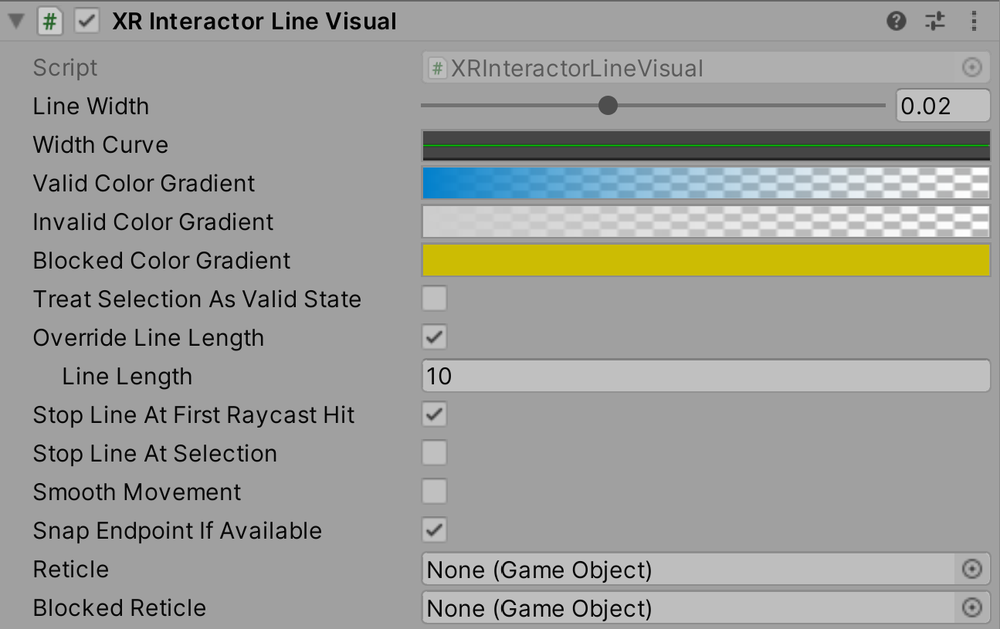

# XR Interactor Line Visual

Interactor helper object aligns a `LineRenderer` with the Interactor.

| **Property** | **Description** |
|---|---|
| **Line Width** | Controls the width of the line. |
| **Width Curve** | Controls the relative width of the line from start to end. |
| **Override Line Origin** | Controls whether to use a different Transform as the starting position and direction of the line. |
| **Line Origin Transform** | The starting position and direction of the line when overriding. |
| **Line Origin Offset** | Offset from line origin along the line direction before line rendering begins. Only works if the line provider is using straight lines. |
| **Set Line Color Gradient** | Determines whether or not this component will control the color of the Line Renderer. Disable to manually control the color externally from this component. |
| **Valid Color Gradient** | Controls the color of the line as a gradient from start to end to indicate a valid state. |
| **Invalid Color Gradient** | Controls the color of the line as a gradient from start to end to indicate an invalid state. |
| **Blocked Color Gradient** | Controls the color of the line as a gradient from start to end to indicate a state where the interactor has a valid target but selection is blocked. |
| **Treat Selection As Valid State** | Forces the use of valid state visuals while the interactor is selecting an interactable, whether or not the interactor has any valid targets. |
| **Override Line Length** | A boolean value that controls which source Unity uses to determine the length of the line. Set to `true` to use the Line Length set by this behavior. Set to `false` to have the length of the line determined by the Interactor. |
| **Line Length** | Controls the length of the line when overriding (the above checkbox must be enabled for this to be used). |
| **Auto Adjust Line Length** | Determines whether the length of the line will retract over time when no valid hits or selection occur. |
| **Minimum Line Length** | Controls the minimum length of the line when overriding. When no valid hits occur, the ray visual shrinks down to this size. |
| **Use Distance To Hit As Max Line Length** | Determines whether the max line length will be the the distance to the hit point or the fixed line length. |
| **Line Retraction Delay** | Time in seconds elapsed after last valid hit or selection for line to begin retracting to the minimum override length. |
| **Line Length Change Speed** |  Scalar used to control the speed of changes in length of the line when overriding it's length. |
| **Stop Line At First Raycast Hit** | Controls whether this behavior always cuts the line short at the first ray cast hit, even when invalid. The line will always be cut short by this behavior when pointing at a valid target. If you wish this line to pass through valid targets, they must be placed on a different layer. - `true` means to do the same even when pointing at an invalid target. - `false` means the line will continue to the configured line length. |
| **Stop Line At Selection** | Controls whether the line will stop at the attach point of the closest interactable selected by the interactor, if there is one. |
| **Smooth Movement** | Controls whether the rendered segments will be delayed from and smoothly follow the target segments. |
| **Snap Endpoint if Available** | Enables the ray visuals to snap the end point the line when the ray hits a [XRInteractableSnapVolume](xr-interactable-snap-volume.md). |
| **Line Bend Ratio** | When line is bent because target end point is out of line with the ray or snap volume is in use, this ratio determines what the bend point is. A value of 1 means the line will not bend. |
| **Reticle** | Stores the reticle that appears at the end of the line when it is valid. |
| **Blocked Reticle** | Stores the reticle that appears at the end of the line when the interactor has a valid target but it selection is blocked. |