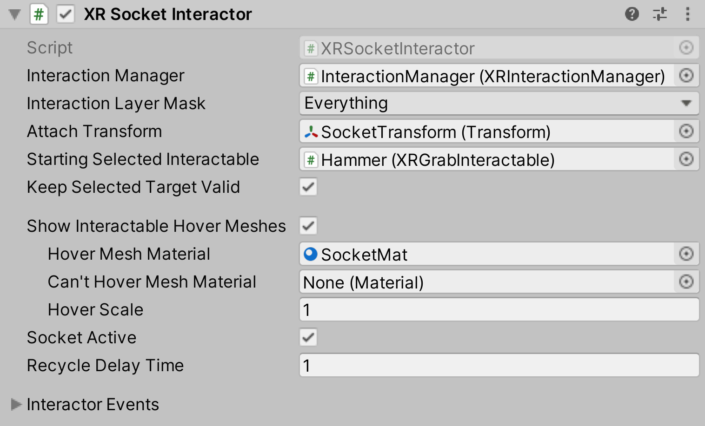

# XR Socket Interactor

Interactor used for holding interactables via a socket. This component is not designed to be attached to a controller (thus does not derive from `XRBaseControllerInteractor`, unlike `XRDirectInteractor` and `XRRayInteractor`) and instead will always attempt to select an interactable that it is hovering over (though will not perform exclusive selection of that interactable).

A socket is defined as the target for a specific interactable, such as a keyhole for a key or a battery socket for a battery. Not to be confused with network programming.

| **Property** | **Description** |
|---|---|
| **Interaction Manager** | The [XRInteractionManager](xr-interaction-manager.md) that this Interactor will communicate with (will find one if **None**). |
| **Interaction Layer Mask** | Allows interaction with Interactables whose [Interaction Layer Mask](interaction-layers.md) overlaps with any Layer in this Interaction Layer Mask. |
| **Attach Transform** | The `Transform` that is used as the attach point for Interactables. Automatically instantiated and set in `Awake` if **None**. Setting this will not automatically destroy the previous object. |
| **Disable Visuals When Blocked In Group** | Whether to disable visuals when this Interactor is part of an [Interaction Group](xr-interaction-group.md) and is incapable of interacting due to active interaction by another Interactor in the Group. |
| **Starting Selected Interactable** | The Interactable that this Interactor automatically selects at startup (optional, may be **None**). |
| **Keep Selected Target Valid** | Whether to keep selecting an Interactable after initially selecting it even when it is no longer a valid target. Enable to make the `XRInteractionManager` retain the selection even if the Interactable is not contained within the list of valid targets. Disable to make the Interaction Manager clear the selection if it isn't within the list of valid targets. A common use for disabling this is for Ray Interactors used for teleportation to make the teleportation Interactable no longer selected when not currently pointing at it. |
| **Show Interactable Hover Meshes** | Whether this socket should show a mesh at socket's attach point for Interactables that it is hovering over. |
| **Hover Mesh Material** | Material used for rendering interactable meshes on hover (a default material will be created if none is supplied). |
| **Can't Hover Mesh Material** | Material used for rendering interactable meshes on hover when there is already a selected object in the socket (a default material will be created if none is supplied). |
| **Hover Scale** | Scale at which to render the hover mesh displayed at the socket's attach point. |
| **Hover Socket Snapping** | Determines if the interactable should snap to the socket's attach transform when hovering. Note this will cause z-fighting with the hover mesh visuals, not recommended to use both options at the same time. If enabled, hover recycle delay functionality is disabled. |
| **Socket Snapping Radius** | When socket snapping is enabled, this is the radius within which the interactable will snap to the socket's attach transform while hovering. |
| **Socket Scale Mode** | Scale mode used to calculate the scale factor applied to the interactable when hovering. |
| **Fixed Scale** | Scale factor applied to the interactable when scale mode is set to Fixed. |
| **Target Bounds Size** | Bounds size used to calculate the scale factor applied to the interactable when scale mode is set to Stretched To Fit Size. |
| **Socket Active** | Whether socket interaction is enabled. |
| **Recycle Delay Time** | Sets the amount of time the socket will refuse hovers after an object is removed. This property does nothing if Hover Socket Snapping is enabled. |
| **Interactor Events** | See the [Interactor Events](interactor-events.md) page. |