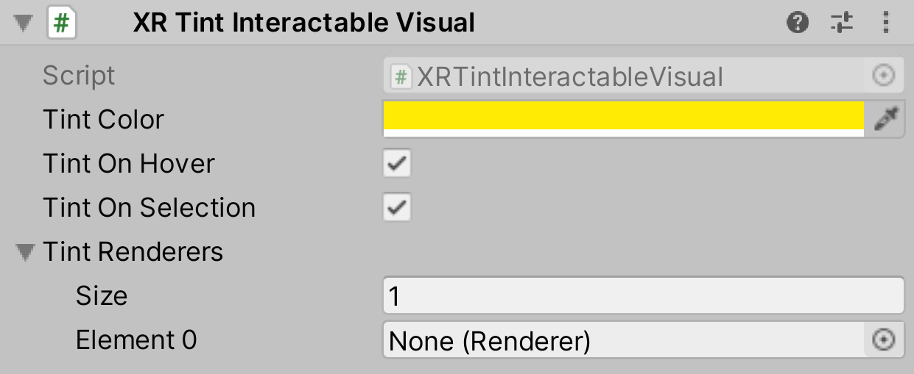

# XR Tint Interactable Visual

Simple Interactable Visual component that demonstrates hover or selection state with emissive tinting.

> [!NOTE]
> This requires use of a shader that supports emission (such as Standard shader) with the variant included in the game build.

| **Property** | **Description** |
|---|---|
| **Tint Color** | The tint color for Interactable. This is used either on hover, if **Tint On Hover** is enabled; on selection, if **Tint On Selection** is enabled; or both, if both are enabled. |
| **Tint On Hover** | Whether this should tint on hover. |
| **Tint On Selection** | Whether this should tint on selection. |
| **Tint Renderers** | The `Renderer`(s) to use for tinting (will default to any `Renderer` on the `GameObject` if not specified). |