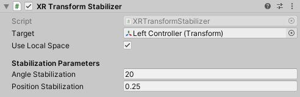

# XR Transform Stabilizer

Provides low-latency stabilization for XR pose inputs, especially useful on rays.

| **Property** | **Description** |
|---|---|
| **Target** | The Transform component whose position and rotation will be matched and stabilized. |
| **Direction Target** | Optional ray component whose endpoint the transform will smoothly rotate to look at. |
| **Use Local Space** | If enabled, will read the target and apply stabilization in local space. Otherwise, in world space. |
| **Angle Stabilization** | Maximum distance (in degrees) that stabilization will be applied. |
| **Position Stabilization** | Maximum distance (in meters) that stabilization will be applied. |
